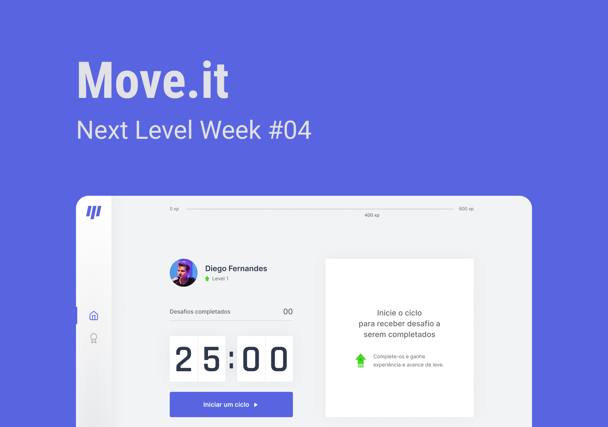
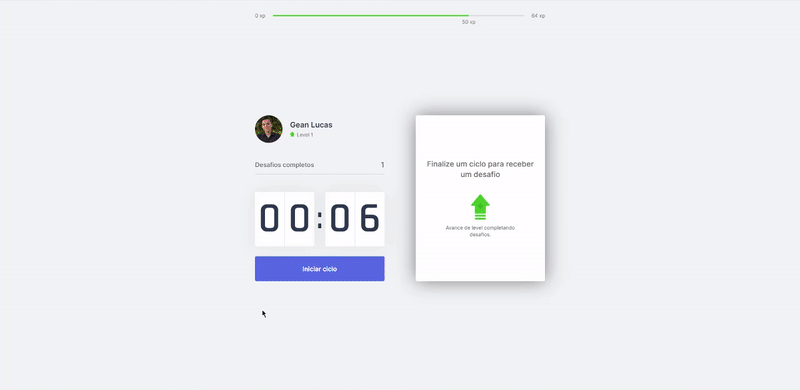

<p align="center">
  
</p>

# [Move.it](https://nextlevelweek-moveit.vercel.app)
   


<p align="center">
  
</p>

<p align="center">
  
</p>


* [Content (en-US)](#section-en_us)
* [Conteúdo (pt-BR)](#secao-pt_br)

---

## About the project <a id="section-en_us"></a>

[Move.it](https://nextlevelweek-moveit.vercel.app) is an application that implements the pomodoro technique, which consists of maintaining a focus period and a rest period during the activities, along with a scoring system that encourages the user to perform body and vision exercises, to relax them and avoid health problems.
The application was built in Next.js, a framework based on React that enables advanced features, such as SSR (Server Side Rendering). User score data is saved locally in the browser using cookies, which make it possible for progress not to be lost when reloading the page.

## Content
  * [Techs](#techs)
  * [How to run the project](#installation)
    * [Installation - Front-end](#installation-front)

## Techs <a id="techs"></a>

- [x] React
- [x] Next
- [x] JS cookie

## How to execute the project <a id="installation"></a>
To execute the project, you'll need to have Node and NPM or Yarn installed to setup all the dependencies.


### Installation - Front-end (Web) <a id="installation-front"></a>

In the project root folder:

```bash
npm install
npm run start
```

If you are using Yarn, use this:
```bash
yarn install
yarn start
```

After finishing installation, the web page will be open in your browser.

---

## Sobre o projeto <a id="secao-pt_br"></a>

O [Move.it](https://nextlevelweek-moveit.vercel.app) é um aplicativo que implementa a técnica de pomodoro, que consiste em manter um período de foco e um período de descanso durante a realização das atividades, junto com um sistema de pontuação que incentiva o usuário a realizar exercícios corporais e de visão, para relaxá-los e evitar possíveis problemas de saúde.
O aplicativo foi feito em Next.js, uma framework baseada em React que possibilita funcionalidades avançadas, como SSR (Server Side Rendering). Os dados de pontuação do usuário são salvos localmente no browser através de cookies, que possibilitam que o progresso não seja perdido ao recarregar a página. 

## Conteúdos 
  * [Tecnologias](#tecnlogias)
  * [Como executar o projeto](#instalacao)
    * [Instalação - Front-end](#instalacao-front)

## Tecnologias <a id="tecnologias"></a>

- [x] React
- [x] Next
- [x] JS cookie

## Como executar o projeto <a id="instalacao"></a>
Para executar o projeto, você irá precisar ter o Node e o NPM ou Yarn instalados para baixar as dependências.


### Instalação - Front-end (Web) <a id="instalacao-front"></a>

Na pasta raíz do repositório:

```bash
npm install
npm run dev
```

Se estiver usando Yarn, utilize
```bash
yarn install
yarn dev
```

Quando terminar, a página da aplicação web será aberta no navegador.

---
###### Developed on Next Level Week from [Rocketseat](https://rocketseat.com.br) by [Gean Lucas](https://www.linkedin.com/in/geanlucaas/) :rocket:.